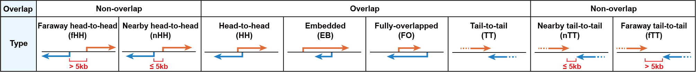
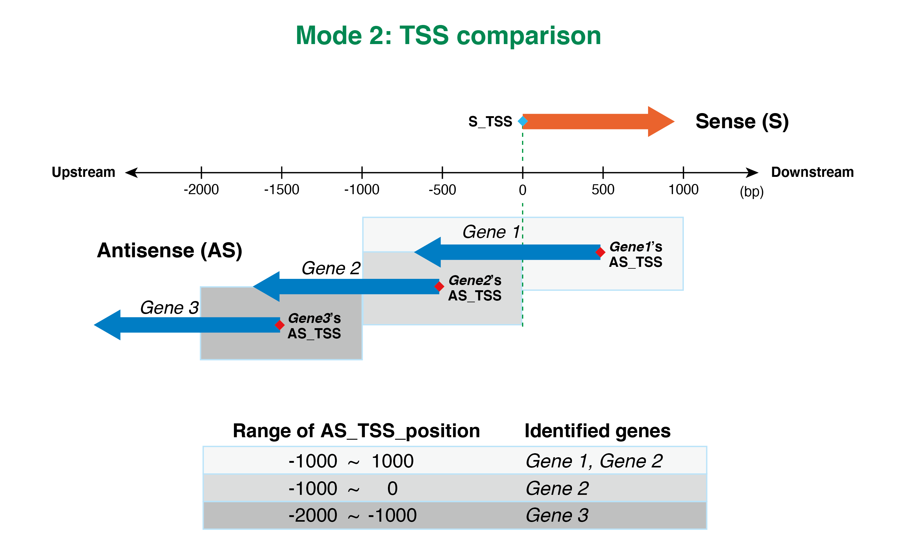
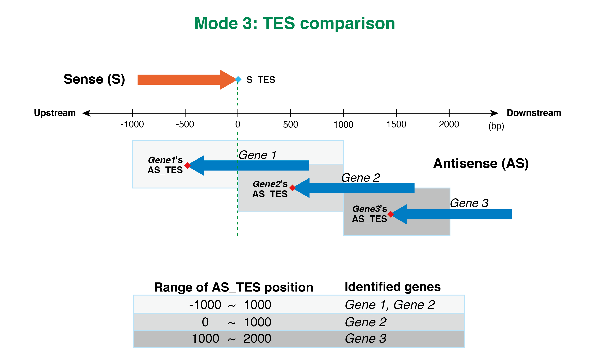

# CCIVR2

## Overview
CCIVR2 is a Python package tool that facilitates the identification of cis-NATs (cis-natural antisense transcript) as well as antisense transcripts that do not overlap with sense genes but have some proximity of transcription start site (TSS) or transcript end site (TES) to each other (including divergent and convergent transcriptions).

CCIVR2 consists of 3 different modes for the identification of antisense transcripts.

**Mode 1** extracts 4 different types of cis-NATs. This mode is identical to the previous CCIVR utility. For details, see [the previous release](https://github.com/CCIVR/ccivr).

**Mode 2** compares the TSS of all genes and extracts antisense transcripts whose TSS is within the optional range of positions relative to the TSS of any sense genes.

**Mode 3** compares the TES of all genes and extracts antisense transcripts whose TES is within the optional range of positions relative to the TES of any sense genes.

In Mode 2 and 3, all identified transcripts are classified into 8 types according to their structural characteristics as shown below.



As with the previous CCIVR, CCIVR2 also requires a CSV-formatted input file containing gene datasets with their location information and with or without expression profile data from RNA-seq. See Input file preparation chapter for more information.  

CCIVR2 generates two CSV-formatted output files: a table file containing a list of all identified genes along with their structural features; a summary file containing the absolute number and percentage of each type of identified gene.


## Requirement

* Python 3.8+

## Installation
You can install CCIVR2 using a package manager `pip` by typing the following command:           

```
pip install git+https://github.com/CCIVR/ccivr2.git
```

Note that this won't work if you don't have git installed on your computer. In that case, download the ZIP file from this site and enter the following command:

```
pip install [full path of unzipped package]
```

If the package manager `pip` does not work, try `pip3` instead.

To check whether CCIVR2 is successfully installed, type the following command:

```
ccivr2 --help
```
If this does not work, check the `$PATH` environment setting. 

The location where CCIVR2 is installed can be found by typing the following command:

```
pip show ccivr2
``` 

## Input file preparation
A CSV-formatted input file is required for the analysis. The input file must contain five different gene annotations listed in their independent columns, as follows: 

- **id**: gene id of each gene. Example: ENSMUSG00000085715   
- **Chr**: chromosome number where the gene is located. Example: X
- **Strand**: strand direction of the gene. Example: +
- **Start**: the minimum number of the gene location. Example: 103431517
- **End**: the maximum number of the gene location. Example: 103484957

(The example above is for the murine *Tsix* gene, from Ensembl GRCm39)  

The order of these five columns can be changed because CCIVR2 recognizes their characters (*i.e.* **id**, **Chr**, **Strand**, **Start**, **End**) but not their order.

These gene annotations can be obtained from gtf file in the Ensembl database. 

You can append other gene annotations by adding extra columns such as “**GeneSymbol**”, “**gene_source**”, “**gene_biotype**”, “**GO_analysis**”, and so on to the input file.

You can also append expression profile information obtained from RNA-seq analysis by adding extra columns such as **"TPM"**, **"FPKM"**, **"fold_change"**, **"padj"**, and so on.

See [the test file](data/ESCs_differentiation_exp_genes.csv) for an example of the input file. 
(The test file contains mouse gene datasets accompanied by expression profiling of mouse ESCs upon differentiation via embryoid body formation, which is consistent with the input file used for the CCIVR2 analysis in Figure 4 of our paper, Suzuki M *et al*., 13:14807, 2023.)


## Usage

To run CCIVR2, specify the path of the input file ```[input CSV path]``` and type the following command:

```
ccivr2 [input CSV path] 
```

By default, output files are saved in the same directory as the input file. To save the output files to another directory, add the optional argument to specify the path of the directory ```[save directory path]``` as follows:

```
ccivr2 [input CSV path] --output [save directory path]
```
Then select the identification mode as follows:

```
Select the identification mode. [1/2/3]:
```

### Mode 1: Cis-NATs mode
This mode identifies 4 types of cis-NATs, as in the previous CCIVR. All identified genes are marked with their structural characteristics, *i.e.* "EB: embedded", "FO: fully-overlapped", "HH: head-to-head", and "TT: tail-to-tail".

### Mode 2: TSS comparison mode
This mode is used to identify antisense transcripts whose TSS (AS\_TSS) is within an optional range of positions relative to the TSS of any sense genes (S\_TSS). Depending on the range set, it is possible to identify some divergent transcriptions and cis-NATs. Users can specify the range by setting two parameters, "min" and "max", which are treated as the upstream and downstream boundaries of the range. The parameters accept both negative and positive numbers.  
For example, if you set the parameters as follows,
```
Set the range of AS_TSS position relative to S_TSS [min,max]: -1000,1000
```
you can identify all antisense transcripts whose AS\_TSS is between 1000 bp upstream and 1000 bp downstream of the S\_TSS. See the figure indicated below.  



### Mode 3: TES comparison mode
This mode is used to identify antisense transcripts whose TES (AS\_TES) is within an optional range of positions relative to the TES of any sense genes (S\_TES). Depending on the range set, it is possible to identify some convergent transcriptions and cis-NATs. As with Mode 2, users can specify the range by selecting two parameters, "min" and "max".  
For example, if you select the parameters as follows,
```
Set the range of AS_TES position relative to S_TES [min,max]: -1000,1000
```
you can identify all antisense transcripts whose TES is between 1000 bp upstream and 1000 bp downstream of the S\_TES. See the figure indicated below.



After all these parameters set, the identification process starts.

### The output files

On completion of all identification processes, two CSV-formatted output files **"Table.csv"** and **"Summary.csv"** will be created and saved in the new directory named **ccivr\_output\_X\_(Y,Z)"**.

**X** is the mode you have selected; *i.e.* mode1, mode2, and mode3.

**Y** and **Z** are the parameters you have set in mode2 and mode3; *e.g.* (-1000,1000).

**Table.csv** contains a list of all identified genes with their structural characteristics, including whether they overlap with the sense genes, what types of the transcripts they are, and the AS\_TSS/AS\_TES position relative to S\_TSS/S\_TES.    
**Summary.csv** contains the absolute number of each type of extracted genes with its percentages of the total genes. 

If no genes are extracted, these files are not created.

Examples of these files in each of the three modes can be found [here](data/examples).

The time required for the entire process depends on the selected mode and extraction conditions. For reference, it takes around 1 minute to process the test file on an iMac 2017 equipped with a 3.4 GHz Intel Core i5 when running in Mode 2 with the AS_TSS range set to (min: -1000, max: 1000).

## Uninstallation
If you no longer use the package, you can uninstall it by typing the following command:

```
pip uninstall ccivr2
```

## Authors
Tatsuya Ohhata conceived CCIVR2. Maya Suzuki designed the CCIVR2 algorithm and implemented the CCIVR2 software.

## License
CCIVR2 is licensed under the [MIT License](LICENSE).

## Reference
Suzuki M *et al*., 13:14807, 2023.

Updated on September 9th, 2023
